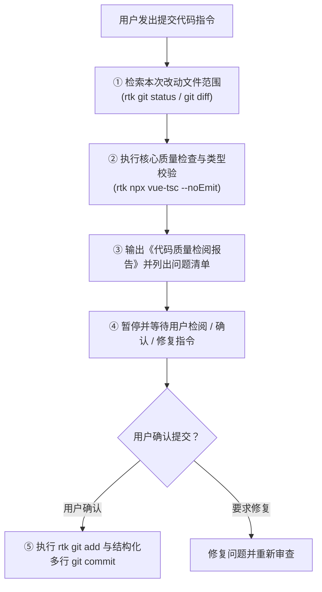

# 代码提交前置质量检查与审查规约 (Pre-Commit Code Quality & Review Standards)

本规约适用于本项目所有涉及代码提交（`git commit`）的操作。旨在保障代码库干净健壮，杜绝冗余死代码、未处理的隐式边界缺陷流入主干分支。

---

## 1. 核心流程与强制行为 (Core Workflow & Mandatory Behavior)

每当用户发出 **“提交代码”**、**“commit”**、**“进行提交”** 或类似意图的指令时：

> [!IMPORTANT]
> **严禁直接执行 `git commit`！**
> 必须严格按照以下三步工作流执行，且必须在输出审查报告后**等待用户检阅与确认**：



---

## 2. 核心检查维度 (Inspection Dimensions)

对本次改动涉及的所有文件（包括新增、修改的 `.vue`、`.ts`、`.js`、`.json`、`.less` 等文件），重点审查以下三个核心维度：

### 2.1 冗余与废弃代码检查 (Redundancy & Dead Code)
- **无用导入与声明**：检查是否存在已被弃用或未被实际引用的 `import` 语句、常量、变量、类型或函数。
- **废弃样式与选择器**：检查组件重构或交互变更后是否遗留未使用的 CSS/LESS 类名与选择器。
- **失效/死逻辑**：检查是否存在条件永远不成立的正则替换、不可达的代码分支或未清理的临时调试日志。

### 2.2 未处理边界情况检查 (Unhandled Edge Cases & Hazards)
- **输入与路径容差**：URL、路径、通配符、正则等是否对末尾斜杠 `/`、协议前缀、空字符串或特殊字符进行了鲁棒的容差归一化。
- **异步与网络兜底**：后台 Webview 加载、异步 Promise、网络请求是否具备超时守卫（Timeout Guard）或失败状态兜底，防止 UI 骨架屏或加载动画无限旋转。
- **资源清理与内存释放**：定时器（`setTimeout` / `setInterval`）、全局事件监听器（`window.addEventListener`）、Webview 会话在组件卸载（`onUnmounted`）或流程中断时是否完整清理。
- **配置持久化与备份完整性**：新增的业务规则、持久化配置是否已完整同步至 `SettingsState` 以及配置备份系统（`exportConfigBackup` / `importConfigBackup`）。

---

## 3. 《代码质量检阅报告》输出规范 (Report Template)

在执行提交前，必须向用户输出结构清晰的检阅报告，格式如下：

```markdown
### 📋 代码提交前置质量检阅报告

#### 1. 改动文件范围
- 列出本次改动的主要文件路径与作用。

#### 2. 核心质量检查结果
- **冗余代码检查**：
  - [无 / 发现的具体问题及位置]
- **边界情况检查**：
  - [无 / 发现的具体潜在缺陷、超时兜底或未处理边界]

#### 3. 待确认事项
- 列出需要用户确认的问题清单（若无问题则声明已就绪），并等待用户发送提交确认指令。
```

---

## 4. 规范化多行 Commit 信息标准 (Commit Message Standards)

### 4.1 强制多行结构规约 (Mandatory Multi-line Structure)
> [!IMPORTANT]
> **严禁使用单行简陋的 Commit 信息（例如禁止仅写 `feat: xxx (v1.5.2)`）！**
> 所有提交信息必须严格遵循 **「首行概括标题 + 空行 + 多项分类条目列表」** 的多行语义化格式：

```text
<type>: <版本升级/核心主题概括>，<核心特性一>、<核心特性二>与<核心特性三>

- release: 将项目版本号提升至 X.Y.Z (若有版本升级)
- feat(<scope>): <具体新增功能、组件或交互能力>
- fix(<scope>): <修复的具体缺陷与边界条件>
- perf(<scope>): <性能与资源优化机制>
- refactor(<scope>): <架构调整与模块重构>
- style(<scope>): <UI文案极简化、视觉样式调整>
- docs(<scope>): <工程规范、开发规则与文档沉淀>
```

### 4.2 常用类型 (Types) 与范围 (Scopes) 对照

| 类型 (Type) | 语义说明 | 常见 Scope 示例 |
| :--- | :--- | :--- |
| `release` | 版本号提升与发布标记 | `release` |
| `feat` | 业务功能、交互组件新增 | `lan`, `media`, `workspace`, `waterfall`, `dialog`, `toast`, `trimmer` |
| `fix` | 修复缺陷、边界异常防崩 | `player`, `sniffer`, `backup`, `parser`, `downloader` |
| `perf` | 性能优化、硬件加速、防体积膨胀 | `ffmpeg`, `gpu`, `cache`, `render` |
| `refactor` | 重构代码、导入规范化、架构解耦 | `import`, `store`, `router`, `videoEditor` |
| `style` | UI 文案极净化、视觉微调、无业务逻辑变动 | `ui`, `copywriting`, `theme` |
| `docs` | 项目 Rules、开发指南与文档变更 | `rules`, `readme`, `standards` |

### 4.3 标准正误对照示例

- ✅ **标准示范**：
```text
feat: 升级版本至 v1.5.2，支持局域网全功能视频编辑、定制对话框与剪辑工作台体验优化

- release: 将项目版本号提升至 1.5.2
- feat(lan): 局域网共享支持全功能视频剪辑（入出点标记与多选段）、视频合并与视频压缩，并通过 SSE 实时推送长耗时进度
- feat(dialog): 局域网 Web 端全面替换原生 alert/confirm/prompt 为 Promise 异步定制模态对话框，提升交互一致性
- feat(toast): 局域网 Web 端 Toast 升级为顶部居中与多消息垂直错开堆叠排布，支持平滑退出
- feat(trimmer): 局域网视频剪辑工作台布局优化（视频高度压缩定高防遮挡、控制功能区独立弹性滚动、微调与标记按钮独立成行、片段清单预留高度、默认覆盖保存）
- style(ui): 全局落地进行中文案极简规约，严禁末尾追加省略号，完成全项目进行中文案清理
- docs(rules): 规范化新增进行中状态提示文案规约与多行结构化 Commit 信息标准
```

- ❌ **错误示范 (严禁使用)**：
  - `feat: 局域网全功能视频编辑、UI文案规约与剪辑工作台体验优化 (v1.5.2)` *(过于简陋，缺失条目明细)*
  - `update code` / `fix bug` *(无任何上下文)*

---

## 5. 提交执行阶段 (Commit Execution)

仅在用户检阅报告并明确给出确认提交的指令后，方可执行：
1. `rtk git add <files>`
2. `rtk git commit -m "<规范化多行提交信息>"`
3. 向用户汇报最终提交的 Commit Hash 与完整的提交说明正文。

