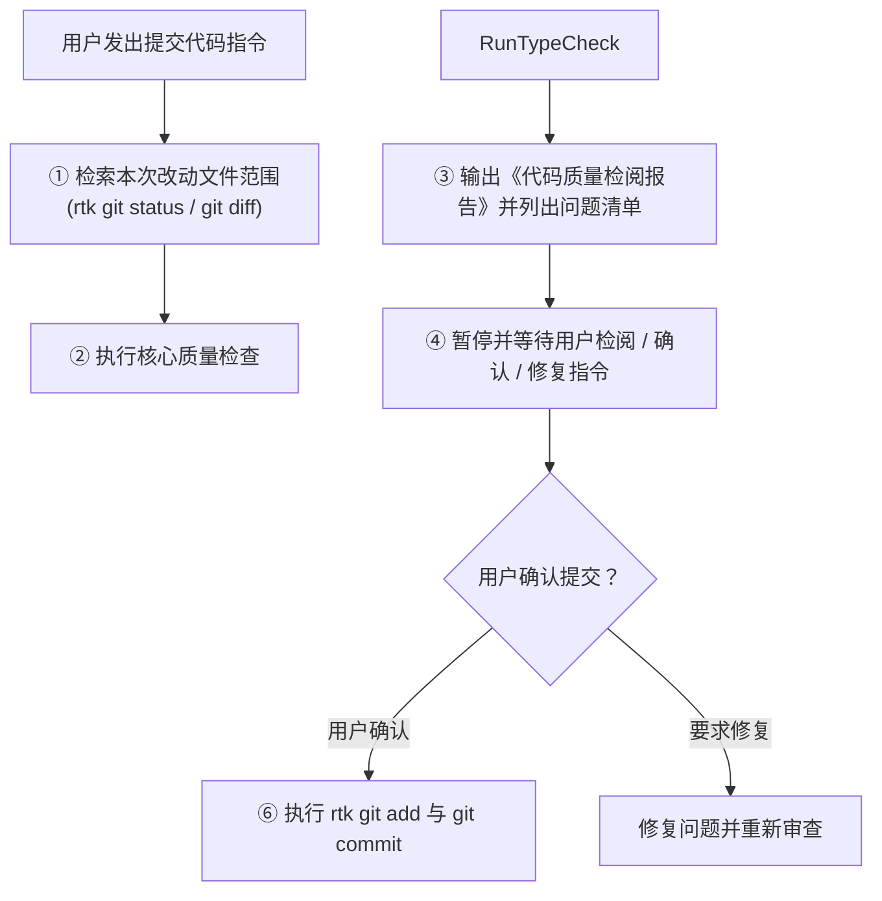

# 代码提交前置质量检查与审查规约 (Pre-Commit Code Quality & Review Standards)

本规约适用于本项目所有涉及代码提交（`git commit`）的操作。旨在保障代码库干净健壮，杜绝冗余死代码、未处理的隐式边界缺陷流入主干分支。

---

## 1. 核心流程与强制行为 (Core Workflow & Mandatory Behavior)

每当用户发出 **“提交代码”**、**“commit”**、**“进行提交”** 或类似意图的指令时：

> [!IMPORTANT]
> **严禁直接执行 `git commit`！**
> 必须严格按照以下三步工作流执行，且必须在输出审查报告后**等待用户检阅与确认**：



---

## 2. 核心检查维度 (Inspection Dimensions)

对本次改动涉及的所有文件（包括新增、修改的 `.vue`、`.ts`、`.js`、`.json`、`.less` 等文件），重点审查以下三个核心维度：

### 2.1 冗余与废弃代码检查 (Redundancy & Dead Code)
- **无用导入与声明**：检查是否存在已被弃用或未被实际引用的 `import` 语句、常量、变量、类型或函数。
- **废弃样式与选择器**：检查组件重构或交互变更后是否遗留未使用的 CSS/LESS 类名与选择器。
- **失效/死逻辑**：检查是否存在条件永远不成立的正则替换、不可达的代码分支或未清理的临时调试日志。

### 2.2 未处理边界情况检查 (Unhandled Edge Cases & Hazards)
- **输入与路径容差**：URL、路径、通配符、正则等是否对末尾斜杠 `/`、协议前缀、空字符串或特殊字符进行了鲁棒的容差归一化。
- **异步与网络兜底**：后台 Webview 加载、异步 Promise、网络请求是否具备超时守卫（Timeout Guard）或失败状态兜底，防止 UI 骨架屏或加载动画无限旋转。
- **资源清理与内存释放**：定时器（`setTimeout` / `setInterval`）、全局事件监听器（`window.addEventListener`）、Webview 会话在组件卸载（`onUnmounted`）或流程中断时是否完整清理。
- **配置持久化与备份完整性**：新增的业务规则、持久化配置是否已完整同步至 `SettingsState` 以及配置备份系统（`exportConfigBackup` / `importConfigBackup`）。

## 3. 《代码质量检阅报告》输出规范 (Report Template)

在执行提交前，必须向用户输出结构清晰的检阅报告，格式如下：

```markdown
### 📋 代码提交前置质量检阅报告

#### 1. 改动文件范围
- 列出本次改动的主要文件路径与作用。

#### 2. 核心质量检查结果
- **冗余代码检查**：
  - [无 / 发现的具体问题及位置]
- **边界情况检查**：
  - [无 / 发现的具体潜在缺陷、超时兜底或未处理边界]

#### 3. 待确认事项
- 列出需要用户确认的问题清单（若无问题则声明已就绪），并等待用户发送提交确认指令。
```

---

## 4. 提交执行阶段 (Commit Execution)

仅在用户检阅报告并明确给出确认提交的指令后，方可执行：
1. `rtk git add <files>`
2. `rtk git commit -m "<规范化语义提交信息>"`
3. 向用户汇报最终提交的 Commit Hash 与提交说明。
