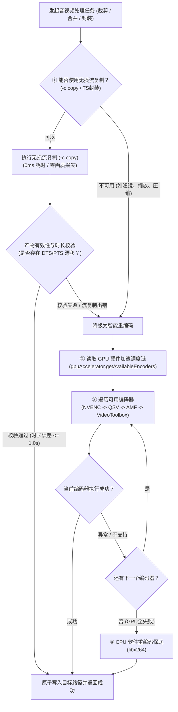

# FFmpeg 与音视频处理工程化规范 (FFmpeg & Media Processing Standards)

本规约适用于本项目所有涉及 FFmpeg / FFprobe 调用的业务模块（包括视频下载合并、分片裁剪、视频合并、码率压缩、元数据探测等）。旨在保障音视频处理的高性能、高稳定性、跨平台硬件兼容性与文件系统安全性。

---

## 1. 核心架构与决策漏斗 (Three-tier Media Decision Funnel)

在执行任何音视频处理任务（裁剪、合并、封装、转码）时，**严禁直接无脑调用 CPU 慢速重编码**，必须严格按照以下三层决策漏斗进行处理：



---

## 2. GPU 硬件加速优先调度与 CPU 回退规范 (Hardware Acceleration Standards)

所有需要进行视频重编码的操作，**必须统一调用 [`electron/gpuAccelerator.ts`](file:///mnt/f/project/tools/Velora/electron/gpuAccelerator.ts) 模块**，严禁在业务代码中硬编码 `-c:v libx264`。

### 2.1 调度优先级标准
系统必须按以下优先级尝试可用的硬件加速编码器：
$$\text{h264\_nvenc (NVIDIA)} \rightarrow \text{h264\_qsv (Intel)} \rightarrow \text{h264\_amf (AMD)} \rightarrow \text{h264\_videotoolbox (Apple Silicon)} \rightarrow \text{libx264 (CPU 保底)}$$

### 2.2 编码器参数适配矩阵 (Encoder Argument Matrix)
统一使用 `getEncoderArgs(encoder, options)` 生成对应的 FFmpeg 编码参数：

| 编码器 (Encoder) | 画质恒定模式 (`mode: 'quality'`) | 目标码率模式 (`mode: 'bitrate'`) |
| :--- | :--- | :--- |
| **`h264_nvenc`** (NVIDIA) | `-c:v h264_nvenc -preset p4 -cq 22` | `-c:v h264_nvenc -preset fast -b:v <B>k -maxrate <1.5B>k -bufsize <2B>k` |
| **`h264_qsv`** (Intel) | `-c:v h264_qsv -preset fast -global_quality 22` | `-c:v h264_qsv -preset fast -b:v <B>k -maxrate <1.5B>k -bufsize <2B>k` |
| **`h264_amf`** (AMD) | `-c:v h264_amf -quality speed -rc cqp -qp_i 22 -qp_p 22` | `-c:v h264_amf -quality speed -b:v <B>k -maxrate <1.5B>k -bufsize <2B>k` |
| **`h264_videotoolbox`** (Apple) | `-c:v h264_videotoolbox -q:v 60` | `-c:v h264_videotoolbox -b:v <B>k -maxrate <1.5B>k -bufsize <2B>k` |
| **`libx264`** (CPU 保底) | `-c:v libx264 -preset fast -crf 20` | `-c:v libx264 -preset fast -b:v <B>k -maxrate <1.5B>k -bufsize <2B>k` |

### 2.3 异常捕获与循环回退模板 (Code Pattern)
```ts
const encoders = await getAvailableEncoders()
let encodeSuccess = false
let lastError = ''

for (const encoder of encoders) {
  if (cancelledTasks.has(taskId)) return { success: false, error: '操作已取消' }
  if (fs.existsSync(tempOutputFile)) {
    try { fs.unlinkSync(tempOutputFile) } catch {}
  }

  const encArgs = getEncoderArgs(encoder, { mode: 'quality' })
  const args = [
    '-y',
    '-progress', 'pipe:1',
    '-i', sourcePath,
    ...encArgs,
    '-c:a', 'aac',
    '-b:a', '192k',
    '-movflags', '+faststart',
    tempOutputFile
  ]

  const isGpu = isGpuEncoder(encoder)
  logger.info('MediaEngine', `尝试使用编码器 [${encoder}] (${isGpu ? 'GPU硬件加速' : 'CPU'})`)

  const res = await runFfmpegCommand(taskId, args, onProgress)
  if (res.success && fs.existsSync(tempOutputFile) && fs.statSync(tempOutputFile).size > 0) {
    encodeSuccess = true
    break
  } else {
    lastError = res.error || res.stderr || ''
    logger.warn('MediaEngine', `编码器 [${encoder}] 执行失败: ${lastError}，尝试下一个编码器`)
  }
}

if (!encodeSuccess) {
  return { success: false, error: `音视频处理失败: ${lastError}` }
}
```

### 2.4 转码重编码码率自适应天花板 (Bitrate Ceiling) 规范
当音视频处理任务因流复制失效降级为转码/重编码（如多视频拼接、滤镜缩放）时，**严禁无约束以固定 CRF / CQ 编码**导致产物文件体积无序膨胀（例如网络流媒体低码率原片经默认参数二次编码导致体积膨胀 2~3 倍）。

1. **原片加权平均码率计算**：
   $$\text{avgBitrateKbps} = \frac{\sum \text{FileSizeBytes} \times 8}{\sum \text{DurationSeconds} \times 1000}$$
2. **动态设定码率天花板（1.15x Headroom）**：
   $$\text{capBitrateKbps} = \max\left(500, \text{round}(\text{avgBitrateKbps} \times 1.15)\right)$$
3. **注入编码器参数**：
   在调用 `getEncoderArgs(encoder, { mode: 'quality', maxrateKbps: capBitrateKbps })` 时传入 `maxrateKbps`，编码器自动追加 `-maxrate <cap>k -bufsize <2*cap>k` 参数，在保障二次有损重编码画质的同时，锁定产物体积不超出原始总体积的 100%~115%。

---

## 3. 双层视频元数据探测规范 (Robust Metadata Probing)

获取视频时长（Duration）、分辨率（Width/Height）、帧率（FPS）及音频流存在性时，**必须具备双层回退链**，严禁因环境缺少 `ffprobe` 导致返回 `duration: 0`。

### 3.1 探测工作流
1. **首选 `ffprobe`（结构化 JSON）**：
   - 执行 `ffprobe -v error -show_entries format=duration -show_entries stream=codec_type,width,height,r_frame_rate -of json <filePath>`。
   - 若解析出有效 `duration > 0` 则直接返回。
2. **保底 `ffmpeg -i`（正则解析）**：
   - 若 `ffprobe` 进程 spawn 报错（如 `ENOENT`）、退出码非 0 或未解析到时长，**必须自动回退** 执行 `ffmpeg -i <filePath>`。
   - 解析 stderr 中的 `Duration: hh:mm:ss.xx`、`Stream #... Video: ... WxH`、`... fps` 以及音频流标记。

---

## 4. 实时进度监控与 IPC 通信规约 (Progress Monitoring & Telemetry)

### 4.1 FFmpeg 命令行参数规范
- 执行 FFmpeg 命令时，必须在输入参数前加入 `-progress pipe:1`。
- 监听子进程的 `stdout`，按行切分并处理。

### 4.2 解析与去重规约 (Deduplication)
由于单次 stdout 数据块可能同时包含 `out_time_us`、`out_time_ms` 与 `out_time`，**必须在每次 chunk 解析中提取最新的有效秒数并仅触发一次 `onProgress` 回调**：
```ts
proc.stdout.on('data', (chunk) => {
  stdoutBuffer += chunk.toString()
  const lines = stdoutBuffer.split('\n')
  stdoutBuffer = lines.pop() || ''

  let progressSec: number | null = null

  for (const line of lines) {
    const trimmed = line.trim()
    if (trimmed.startsWith('out_time_us=')) {
      const val = parseInt(trimmed.substring(12), 10)
      if (!isNaN(val) && val >= 0) {
        progressSec = val / 1000000
      }
    } else if (trimmed.startsWith('out_time=')) {
      const timeParts = trimmed.substring(9).split(':')
      if (timeParts.length === 3) {
        const h = parseFloat(timeParts[0]) || 0
        const m = parseFloat(timeParts[1]) || 0
        const s = parseFloat(timeParts[2]) || 0
        const parsed = h * 3600 + m * 60 + s
        if (!isNaN(parsed) && parsed >= 0) {
          progressSec = parsed
        }
      }
    }
  }

  if (progressSec !== null && onProgress) {
    onProgress(progressSec)
  }
})
```

### 4.3 进度百分比与分段权重
- **0% ~ 5%**：元数据分析与准备阶段。
- **5% ~ 95%**：处理核心阶段，基于探测到的实际总时长 `(sec / totalDuration)` 线性计算。
- **98%**：完成编码，正在执行原子落盘与写入文件。
- **100%**：完成全部流程。

---

## 5. 临时文件生命周期与原子落盘安全 (File Lifecycle & Safety)

### 5.1 临时目录隔离
- 所有音视频剪辑分片、临时合并产物必须生成在专用临时目录：`getTempDir()`（即 `userData/tmp`）。
- 文件命名需包含时间戳与唯一标识（如 `velora_merge_${Date.now()}_final.mp4`）。

### 5.2 资源清理保证 (Mandatory Cleanup)
- 记录所有创建的中间文件路径 `tempFilesToClean: string[]`。
- **必须在 `finally` 块中遍历删除所有存在的临时文件**，防止磁盘垃圾残留。

### 5.3 原子替换与跨盘安全
- 将临时文件移动至最终目标路径时，使用原子替换操作：
  - 同分区：`fs.renameSync(tempFile, targetPath)`。
  - 跨分区（捕获 `EXDEV` 错误）：执行 `fs.copyFileSync` + `fs.unlinkSync`，或调用 `safeAtomicReplace`。
- 覆盖已有原文件时（如原位剪辑保存），必须预先记录源文件的 `mtime` / `atime`，写入完成后通过 `fs.utimesSync` 精准恢复，避免破坏资源管理器排序。

---

## 6. 开发自检清单 (Self-Verification Checklist)

在修改或新增任何音视频处理逻辑后，必须完成以下自检确认：

- [ ] **无死写 libx264**：所有视频转码操作均统一通过 `getAvailableEncoders()` 与 `getEncoderArgs()` 调度。
- [ ] **具备 GPU 回退能力**：转码执行逻辑包裹在编码器遍历循环中，GPU 失败自动降级到 CPU。
- [ ] **码率天花板约束**：二次转码合并时已计算输入源文件平均码率并注入 1.15x `maxrateKbps` 码率上限，防止产物体积异常膨胀。
- [ ] **流复制校验完整**：使用 `-c copy` 的地方均配备产物大小及时长有效性校验。
- [ ] **双层元数据探测**：`probeVideo` 具备 `ffprobe -> ffmpeg -i` 完整回退，不返回 0 时长。
- [ ] **进度解析无重复**：`stdout` 进度解析单 chunk 内已去重。
- [ ] **临时文件必清理**：所有中间产物均在 `finally` 块中执行清理。
- [ ] **轻量校验通过**：运行 `rtk npx vue-tsc --noEmit` 确保 0 错误（严禁/无需运行 build）。
