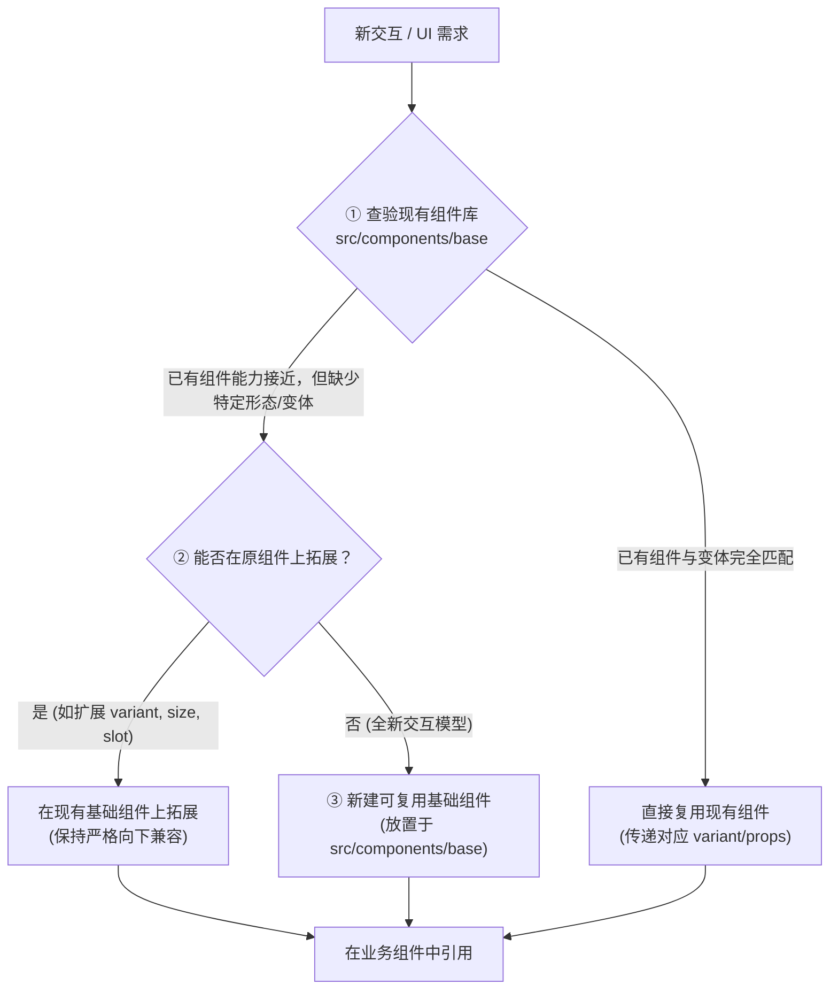

# UI 基础组件库与工程化规范 (UI Component & Engineering Standards)

本规约适用于本项目所有 Vue 组件、业务页面、Composables、工具函数及交互控件的新增、修改与重构。旨在保障全局视觉语言统一、交互行为一致、代码高度解耦与可持续扩展。

---

## 1. 全局模块导入路径规范 (Module Import Path Standards)

在任何 `.vue` 组件、`.ts` 脚本及测试代码中，**严禁使用相对跨层路径进行模块引入**，必须统一采用 `@/` 路径别名（Alias）：

### 1.1 强制规范要求
- **严禁使用相对路径**：禁止使用形如 `'../base/VIcon.vue'`、`'../../composables/useSettings'`、`'./useMessage'` 的相对路径引用。
- **强制使用 `@/` 别名**：全局一律使用 `@/` 路径别名引用 `src/` 下的任何模块、组件、Composable、服务或工具。

### 1.2 正误对照示例

| 类型 | 错误示范 (严禁使用) | 正确示范 (强制规范) |
| :--- | :--- | :--- |
| **基础 UI 组件** | `import VIcon from '../base/VIcon.vue'` `import VButton from '../../components/base/VButton.vue'` | `import VIcon from '@/components/base/VIcon.vue'` `import VButton from '@/components/base/VButton.vue'` |
| **功能组件/弹窗** | `import ParseRuleDialog from '../features/ParseRuleDialog.vue'` | `import ParseRuleDialog from '@/components/features/ParseRuleDialog.vue'` |
| **Composables** | `import { useSettings } from '../../composables/useSettings'` | `import { useSettings } from '@/composables/useSettings'` |
| **服务与工具** | `import { logger } from '../../services/logger'` `import { sanitizeFilename } from '../../utils/filename'` | `import { logger } from '@/services/logger'` `import { sanitizeFilename } from '@/utils/filename'` |
| **常量与类型** | `import { APP_PREFIX } from '../../constants'` `import type { ConfigBackupSectionKey } from '../types/backup'` | `import { APP_PREFIX } from '@/constants'` `import type { ConfigBackupSectionKey } from '@/types/backup'` |
| **动态导入** | `defineAsyncComponent(() => import('../features/InspectorDialog.vue'))` | `defineAsyncComponent(() => import('@/components/features/InspectorDialog.vue'))` |

---

## 2. 组件开发决策漏斗 (Three-tier Decision Funnel)

在实现任何新的 UI 或交互需求时，**严禁在业务页面/功能组件内直接裸写原生交互元素或自造一次性轮子**，必须严格按照以下“三层漏斗”决策流程进行：

### 第一层：优先查验与直接复用 (Reuse)
- 首先检索 [`src/components/base/`](file:///mnt/f/project/tools/Velora/src/components/base/)，确认是否有现成组件能满足需求。
- 确认现有组件的所有已有变体（`variant`）、尺寸（`size`）及插槽（`slots`）。

### 第二层：向下兼容扩展已有基础组件 (Extend)
- 如果现有基础组件功能相似但缺少特定视觉变体、图标位置或事件支持：
  - **优先在原基础组件上扩展**，例如在 `VButton.vue` 增加新的 `variant` 或 `size`。
  - **原则**：扩展必须保持**严格向下兼容**，所有新增的 `props` 必须提供默认值，严禁引发已有业务组件的破坏性变更（Breaking Changes）。

### 第三层：新建高复用性基础组件 (Create New Base)
- 当遇到全新的通用交互形态（如滑动输入条 `VSlider`、标签 `VTag`、模态窗底座 `VModal` 等）：
  - **严禁**在业务页面或 `features/` 组件内写死私有交互逻辑。
  - **必须**在 [`src/components/base/`](file:///mnt/f/project/tools/Velora/src/components/base/) 创建独立的通用组件，将其打磨为纯净、可复用的标准控件后供业务层调用。

---

## 3. 基础组件设计与工程化规范 (Base Component Engineering Specs)

所有位于 [`src/components/base/`](file:///mnt/f/project/tools/Velora/src/components/base/) 下的组件均须符合以下标准：

1. **统一命名规范**：
   - 文件名与组件名必须以大写字母 `V` 开头，采用 PascalCase（如 `VButton.vue`, `VInput.vue`, `VIcon.vue`, `VSwitch.vue`, `VCheckbox.vue`, `VInputSelect.vue`）。
2. **零业务耦合 (Zero Business Coupling)**：
   - 基础组件必须是纯受控或半受控的纯 UI 交互控件。
   - **严禁**在基础组件内直接引入业务 Composable（如 `useSettings`, `useDownloads`, `useCMS`）、Pinia Store、路由对象或 API 接口。
   - 业务数据和行为必须通过 `props`、`v-model`、`emits` 和 `slots` 进行输入与输出。
3. **完备的 TypeScript 类型定义**：
   - 使用 `<script setup lang="ts">`。
   - 必须为组件的 Props、Emits 及相关数据结构（如选项列表 `OptionItem`）定义并导出明确的 TypeScript 类型接口。
4. **统一主题系统与 CSS 变量**：
   - 颜色、圆角、阴影、字体、边框、层级必须使用全局 CSS 变量（如 `var(--bg-primary)`, `var(--bg-card)`, `var(--color-accent)`, `var(--border-light)`, `var(--text-primary)` 等）。
   - 严禁硬编码 hex/rgb 颜色，确保在深色/浅色主题切换时自适应。
5. **标配基础状态支持**：
   - 交互类组件应视需要支持 `disabled`、`loading`、`size`（`small` / `medium` / `large`）及各类焦点/悬浮态动效。

---

## 4. 矢量图标规约与扩展流程 (Icon Standards)

### 核心原则
- **严禁**在任何业务组件、页面或弹窗内直接书写原生 `<svg>` 标签或内联 SVG 矢量数据。
- **所有图标统一由 [`src/components/base/VIcon.vue`](file:///mnt/f/project/tools/Velora/src/components/base/VIcon.vue) 管理和渲染。**

### 新增/扩展图标标准流程
当业务需要使用尚未收录的新图标时，按以下流程进行标准化收录：
1. 打开 [`src/components/base/VIcon.vue`](file:///mnt/f/project/tools/Velora/src/components/base/VIcon.vue)。
2. 在 `IconName` 联合类型中增加新图标命名（例如 `| 'my-new-icon'`）。
3. 在 `iconsMap` 字典中添加对应的矢量内层元素字符串（统一基于 `viewBox="0 0 24 24"` 视窗规范）。
4. 在业务组件中通过 `<VIcon name="my-new-icon" :size="16" />` 调用。

---

## 5. 基础组件选型对照表与强制规约 (Component Mapping & Mandatory Rules)

为确保全站 UI 风格一致与交互无缝，**严禁在任何业务组件中使用原生表单/交互裸标签**，必须严格按照以下对照表使用基础组件：

| 原生裸标签 (严禁使用) | 对应基础组件 | 推荐调用范式与说明 |
| :--- | :--- | :--- |
| `<select>` / `<option>` | **`VInputSelect`** | **纯下拉选择**：`:allow-input="false"`（点击唤起浮层，禁止文本输入）。 **输入+下拉**：`:allow-input="true"`（默认）。 选项格式：`options: InputSelectOption[]` (`{ label: string, value: string, depth?: number }`)。 |
| `<input type="checkbox">` | **`VCheckbox`** | **布尔切换**：`<VCheckbox v-model="form.enabled">标签文本</VCheckbox>`。 **多选数组**：`<VCheckbox v-model="selectedList" :value="id">标签</VCheckbox>`。 |
| `<input type="radio">` | **`VSwitch`** | **分段单选**：`<VSwitch v-model="currMode" :options="modeOptions" />`。 |
| `<input type="text/password/number">` | **`VInput`** | `<VInput v-model="text" placeholder="..." clearable @enter="..." />`。 |
| `<button>` | **`VButton`** | `<VButton variant="primary | secondary | danger | icon" :loading="..." />`。 |
| `<svg>` / 内联矢量图形 | **`VIcon`** | `<VIcon name="icon-name" :size="16" />`（未收录图标先入库 `VIcon.vue`）。 |

---

## 6. 核心基础组件调用速查 (Base Components Reference)

### 6.1 `VInputSelect` (下拉选择 / 组合输入器)
- **Props**:
  - `modelValue: string` - 绑定的选定值。
  - `options?: InputSelectOption[]` - 选项列表，每项需包含 `label` 与 `value`，可选 `depth`（支持缩进层级树状显示）。
  - `allowInput?: boolean` - 是否允许在输入框中自由输入内容（**作为纯下拉选择框使用时必须显式传 `:allow-input="false"`**）。
  - `placeholder?: string` - 占位符文本。
  - `disabled?: boolean` - 是否禁用。
- **Events**:
  - `@update:modelValue` / `@change`: 选项变动或输入变更时触发。
  - `@enter`: 回车触发。

### 6.2 `VCheckbox` (复选框)
- **Props**:
  - `modelValue: boolean | any[]` - 支持直接双向绑定布尔值或多选数组。
  - `value?: string | number | boolean` - 数组多选模式下当前选项的值。
  - `disabled?: boolean` - 是否禁用。
- **Slots**:
  - `default` - 复选框右侧显示的文字内容（无需在外部再套额外 label 或监听点击事件）。

### 6.3 `VSwitch` (开关 / 分段切换器)
- **Props**:
  - `modelValue: boolean | string | number`
  - `options?: Array<{ label: string, value: any }>` - 传入选项时渲染为 Segmented Control 分段控制器；不传时渲染为经典滑动开关。
  - `disabled?: boolean`

### 6.4 `VButton` (按钮)
- **Props**:
  - `variant`: `'primary' | 'secondary' | 'danger' | 'danger-soft' | 'icon' | 'icon-secondary' | 'icon-danger'`
  - `size`: `'small' | 'medium' | 'large'`
  - `disabled?: boolean`
  - `loading?: boolean`

---

## 7. 多项与批量操作文案规约 (Multi-item & Batch Operation Copywriting Standards)

为保持全站操作触发载体（菜单、按钮、弹窗标题）视觉语言的极简、纯粹与单选/多选一致性，所有涉及多项选择或批量操作的交互文本必须严格遵循以下规范：

### 7.1 菜单项与操作按钮 (Action Buttons & Menus)
- **严禁拼接数量提示**：严禁在操作按钮或右键菜单项中文本末尾拼接 `(N 项)`、`(N项)`、`N个项目` 等数量修饰词。
- **强制统一采用纯动词**：无论当前处于单选还是多选状态，操作按钮与菜单项一律使用纯动词形式。
  - ✅ 正确：`移动`、`删除`、`开始合并`、`开始压缩`、`暂停`、`继续`
  - ❌ 错误：`移动 (3 项)`、`删除 (5 项)`、`开始合并 (2项)`、`开始压缩 (4项)`、`批量移动`、`批量删除`

### 7.2 弹窗标题 (Modal Titles)
- 多项操作唤起的弹窗标题采用通用概括描述，严禁在标题中动态注入具体数字。
  - ✅ 正确：`移动选中的项目`
  - ❌ 错误：`移动选中的 5 个项目`

### 7.3 二次确认弹窗与反馈提示 (Confirmation & Feedback Toasts)
- 二次确认对话框提示语采用通用描述，聚焦操作行为本身及不可逆风险提醒。
  - ✅ 正确：`确定要永久删除选中的文件和文件夹吗？此操作不可恢复。`、`确定要删除选中的任务记录吗？`
  - ❌ 错误：`确定要删除选中的 8 个任务记录吗？`
- Toast/Message 操作反馈与进度提示采用清晰的结果描述。
  - ✅ 正确：`正在移动选中的项目`、`已成功移动选中的项目`、`已删除选中的任务及对应文件`、`已将选中的视频加入压缩处理队列`
  - ❌ 错误：`正在移动 3 个项目...`、`已成功移动 3 个项目`、`已删除选中的 5 个任务...`

### 7.4 允许展示计数的专属区域 (Permitted Count Locations)
- 仅允许在**纯状态展示区**（如页面底部状态栏 `共 10 项`、`已选中: 3 项`、工具栏静态选择计数徽标 `已选择 5 项`）展示数量统计；**严禁将计数污染至操作触发按钮与菜单项**。

---

## 8. 进行中与状态提示文本规约 (In-Progress & State Copywriting Standards)

所有界面提示信息（如 Toast、Message、加载骨架屏提示、任务进度条状态文案、后台处理阶段通知等）在描述进行中状态时，必须保持直接、干脆、明确：

### 8.1 严禁添加省略号结尾 (No Trailing Ellipsis)
- **核心规约**：进行中状态文本必须采用清晰干脆的动宾短语或明确状态陈述，**严禁在末尾追加 `...`、`…` 或 `。。。` 省略号**。
- **正误对照示例**：
  - ✅ 正确示范：`正在启动任务`、`正在处理`、`正在分析视频时长与元数据`、`正在合并视频`、`正在智能转码合并`、`正在压缩视频`、`正在扫描目录树`、`正在移动选中的项目`、`正在覆盖保存原文件`、`正在写入目标文件`
  - ❌ 错误示范：`正在启动任务...`、`正在处理...`、`正在分析视频时长与元数据...`、`正在合并视频...`、`正在智能转码合并...`、`正在压缩视频...`、`正在扫描目录树...`、`正在移动选中的项目...`、`正在覆盖保存原文件...`、`正在写入目标文件...`

### 8.2 避免冗余过程修饰
- 提示文本直接指明当前业务行为或操作对象，避免“系统正在准备执行XXX请稍候...”等拖沓陈述。

---

## 9. 开发与修改自检清单 (Self-Verification Checklist)

在每次编写或修改任何 `.vue` 或 `.ts` 文件后，必须完成以下自检确认：

- [ ] **0 相对路径导入**：全局一律使用 `@/` 路径别名（如 `@/components/base/VIcon.vue`、`@/composables/useSettings`），严禁使用 `../` 或 `./` 跨层相对路径。
- [ ] **0 内联 SVG**：检查提交代码中无裸露的 `<svg>` 标签，全量使用 `<VIcon>`。
- [ ] **0 原生交互裸标签**：按钮、输入框、复选框、单选框、下拉框等均全量使用 `@/components/base/` 封装组件。
- [ ] **无重复造轮子**：新功能中未引入私有定制的基础控件，通用交互已沉淀在 `src/components/base/`。
- [ ] **向下兼容性**：对现有 base 组件的任何改动均未破坏既有业务调用（新 props 必须具备默认值）。
- [ ] **多项文案极简规范**：检查菜单与操作按钮无 `(N 项)` 后缀，全量使用纯动词；弹窗标题与确认反馈无数字拼接。
- [ ] **进行中文案无省略号**：检查所有 Toast、进度文本、加载状态文案均无结尾省略号（如必须为“正在启动任务”，严禁“正在启动任务...”）。
- [ ] **轻量校验通过**：运行 `rtk npx vue-tsc --noEmit` 确保 0 错误（严禁/无需运行 build）。
