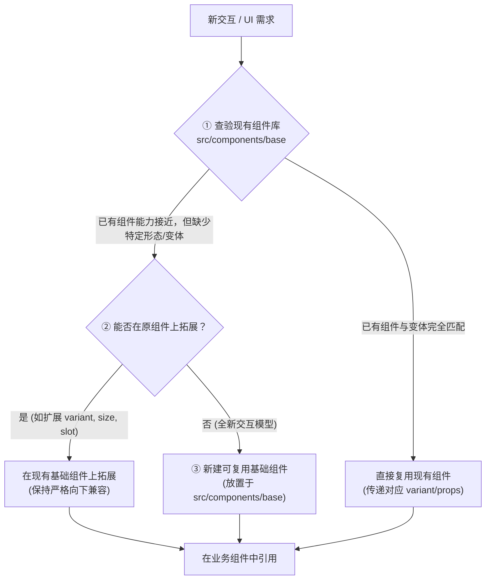

# UI 基础组件库与交互规范 (UI Component & Extension Standards)

本规约适用于本项目所有 Vue 组件、业务页面及交互控件的新增、修改与重构。旨在保障全局视觉语言统一、交互行为一致、代码高度解耦与可持续扩展。

---

## 1. 组件开发决策漏斗 (Three-tier Decision Funnel)

在实现任何新的 UI 或交互需求时，**严禁在业务页面/功能组件内直接裸写原生交互元素或自造一次性轮子**，必须严格按照以下“三层漏斗”决策流程进行：

### 第一层：优先查验与直接复用 (Reuse)
- 首先检索 [`src/components/base/`](file:///mnt/f/project/tools/Velora/src/components/base/)，确认是否有现成组件能满足需求。
- 确认现有组件的所有已有变体（`variant`）、尺寸（`size`）及插槽（`slots`）。

### 第二层：向下兼容扩展已有基础组件 (Extend)
- 如果现有基础组件功能相似但缺少特定视觉变体、图标位置或事件支持：
  - **优先在原基础组件上扩展**，例如在 `VButton.vue` 增加新的 `variant` 或 `size`。
  - **原则**：扩展必须保持**严格向下兼容**，所有新增的 `props` 必须提供默认值，严禁引发已有业务组件的破坏性变更（Breaking Changes）。

### 第三层：新建高复用性基础组件 (Create New Base)
- 当遇到全新的通用交互形态（如滑动输入条 `VSlider`、标签 `VTag`、模态窗底座 `VModal` 等）：
  - **严禁**在业务页面或 `features/` 组件内写死私有交互逻辑。
  - **必须**在 [`src/components/base/`](file:///mnt/f/project/tools/Velora/src/components/base/) 创建独立的通用组件，将其打磨为纯净、可复用的标准控件后供业务层调用。

---

## 2. 基础组件设计与工程化规范 (Base Component Engineering Specs)

所有位于 [`src/components/base/`](file:///mnt/f/project/tools/Velora/src/components/base/) 下的组件均须符合以下标准：

1. **统一命名规范**：
   - 文件名与组件名必须以大写字母 `V` 开头，采用 PascalCase（如 `VButton.vue`, `VInput.vue`, `VIcon.vue`, `VSwitch.vue`, `VCheckbox.vue`, `VInputSelect.vue`）。
2. **零业务耦合 (Zero Business Coupling)**：
   - 基础组件必须是纯受控或半受控的纯 UI 交互控件。
   - **严禁**在基础组件内直接引入业务 Composable（如 `useSettings`, `useDownloads`, `useCMS`）、Pinia Store、路由对象或 API 接口。
   - 业务数据和行为必须通过 `props`、`v-model`、`emits` 和 `slots` 进行输入与输出。
3. **完备的 TypeScript 类型定义**：
   - 使用 `<script setup lang="ts">`。
   - 必须为组件的 Props、Emits 及相关数据结构（如选项列表 `OptionItem`）定义并导出明确的 TypeScript 类型接口。
4. **统一主题系统与 CSS 变量**：
   - 颜色、圆角、阴影、字体、边框、层级必须使用全局 CSS 变量（如 `var(--bg-primary)`, `var(--bg-card)`, `var(--color-accent)`, `var(--border-light)`, `var(--text-primary)` 等）。
   - 严禁硬编码 hex/rgb 颜色，确保在深色/浅色主题切换时自适应。
5. **标配基础状态支持**：
   - 交互类组件应视需要支持 `disabled`、`loading`、`size`（`small` / `medium` / `large`）及各类焦点/悬浮态动效。

---

## 3. 矢量图标规约与扩展流程 (Icon Standards)

### 核心原则
- **严禁**在任何业务组件、页面或弹窗内直接书写原生 `<svg>` 标签或内联 SVG 矢量数据。
- **所有图标统一由 [`src/components/base/VIcon.vue`](file:///mnt/f/project/tools/Velora/src/components/base/VIcon.vue) 管理和渲染。**

### 新增/扩展图标标准流程
当业务需要使用尚未收录的新图标时，按以下流程进行标准化收录：
1. 打开 [`src/components/base/VIcon.vue`](file:///mnt/f/project/tools/Velora/src/components/base/VIcon.vue)。
2. 在 `IconName` 联合类型中增加新图标命名（例如 `| 'my-new-icon'`）。
3. 在 `iconsMap` 字典中添加对应的矢量内层元素字符串（统一基于 `viewBox="0 0 24 24"` 视窗规范）。
4. 在业务组件中通过 `<VIcon name="my-new-icon" :size="16" />` 调用。

---

## 4. 现有基础组件速查表 (Base Components Registry)

| 组件名 | 说明 | 核心 Props / 功能 |
| :--- | :--- | :--- |
| **`VIcon`** | 统一矢量图标库 | `name`, `size`, `color`, `strokeWidth` |
| **`VButton`** | 基础按钮 | `variant`: `'primary' \| 'secondary' \| 'danger' \| 'danger-soft' \| 'icon' \| 'icon-secondary' \| 'icon-danger'`, `size`, `disabled`, `loading` |
| **`VInput`** | 文本/数字输入框 | `v-model`, `type`, `placeholder`, `disabled`, `clearable`, `@enter`, `@clear` |
| **`VCheckbox`** | 复选框 | `v-model` (支持布尔或数组绑定), `value`, `disabled`, 默认插槽文本 |
| **`VSwitch`** | 开关 / 分段切换器 | `modelValue`, `options` (支持布尔双态或多项分段选择), `disabled` |
| **`VInputSelect`** | 组合下拉选择器 | `modelValue`, `options`, `placeholder`, `searchable`, `allowCustom` |

---

## 5. 开发与修改自检清单 (Self-Verification Checklist)

在每次编写或修改任何 `.vue` 文件后，必须完成以下自检确认：

- [ ] **0 内联 SVG**：检查提交代码中无裸露的 `<svg>` 标签，全量使用 `<VIcon>`。
- [ ] **0 原生交互裸标签**：按钮、输入框、复选框、下拉框等均使用 `@/components/base/` 封装组件。
- [ ] **无重复造轮子**：新功能中未引入私有定制的基础控件，通用交互已沉淀在 `src/components/base/`。
- [ ] **向下兼容性**：对现有 base 组件的任何改动均未破坏既有业务调用（新 props 具有默认值）。
- [ ] **轻量校验通过**：运行 `rtk npx vue-tsc --noEmit` 确保 0 错误（严禁/无需运行 build）。
